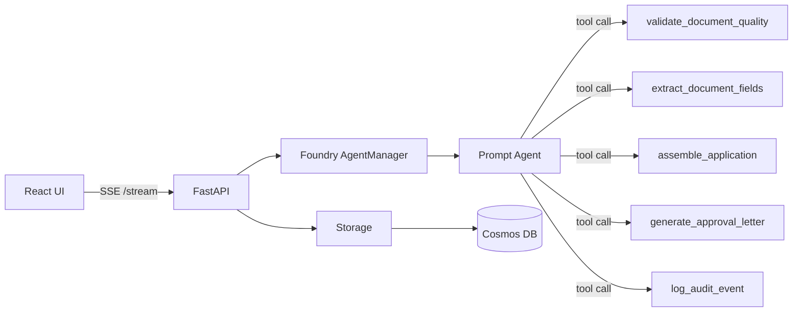

# LoanFlow AI

Hackathon project: a 0→1 build in hours, shipped and deployable on Azure.

LoanFlow AI is an AI-native lending platform reference app covering origination and servicing using:
- FastAPI backend (`py/apps/loan-origination`)
- React/Vite frontend (`ts/apps/loan-ui`)
- Azure AI Foundry Prompt Agents + tool calling
- Azure Document Intelligence for lending document workflows
- Terraform + azd deployment (`infra/`)

## Architecture (Quick View)



## Executive Summary

This project demonstrates two connected lending experiences:

1. **Origination assistant (Demo 1)**
   - conversational intake
   - document upload
   - document quality validation
   - extraction of applicant data
   - application summarization
   - internal review + approval letter generation
   - human-in-the-loop confirmation

2. **Servicing assistant (Demo 2)**
   - customer-specific portfolio Q&A
   - policy and fee explanation
   - eligibility guidance for additional borrowing
   - path toward transactional actions such as autopay setup

Together, these demos cover the lending lifecycle end-to-end: **origination** and **servicing/retention/cross-sell**.

## Strategic Value

- Lower manual processing cost
- Faster application handling
- Better customer self-service
- More consistent decisions and communications
- Scalable broker/applicant/borrower support
- Stronger auditability through structured action logs

## Start Here (Docs Map)

Use README as the quick entrypoint. Deep details are in docs:

- Architecture and design decisions: [docs/system-design.md](docs/system-design.md)
- Local setup and runbook: [docs/dev-setup.md](docs/dev-setup.md)
- Local testing guide: [docs/local-testing.md](docs/local-testing.md)
- Business usage guide: [docs/business-usage.md](docs/business-usage.md)
- Security model: [docs/security-design.md](docs/security-design.md)
- Network and private connectivity: [docs/network-design.md](docs/network-design.md)
- Processor design: [docs/processors-design.md](docs/processors-design.md)

## Developer Quick Start

### Backend

```bash
cd py/apps/loan-origination
uv sync
uv run uvicorn main:app --reload --host 0.0.0.0 --port 8002
```

### Frontend

```bash
cd ts/apps/loan-ui
pnpm install
pnpm dev
```

### Optional (Full stack via Docker)

```bash
docker compose up --build
```

## API Summary

| Endpoint | Method | Purpose |
|---|---|---|
| `/healthz` | GET | Health check |
| `/api/v1/loan/stream` | POST | SSE streaming origination assistant |
| `/api/v1/loan/upload` | POST | Upload and register lending documents |
| `/api/v1/loan/{id}` | GET | Read application details |
| `/api/v1/loan/{id}/audit` | GET | Read audit trail |
| `/api/v1/loan/{id}/documents` | GET | Read uploaded/extracted documents |
| `/docs` | GET | OpenAPI UI |

## Key Design Choices (One-page)

- SSE streaming for long reports and responsive UX
- Temporary agent per request for isolation and cleanup
- ToolRegistry abstraction for typed tool calling + tracing
- Dual storage mode (`inmemory` local, `cosmos` in Azure)
- New AI Foundry resource model (`CognitiveServices/accounts` + project)
- Built-in document quality + extraction pipeline for financial documents

For rationale and implementation trade-offs, see [docs/system-design.md](docs/system-design.md).

## Deploy to Azure

```bash
azd provision
azd deploy
```

Deployment architecture and infra modules are documented in [infra/README.md](infra/README.md).

